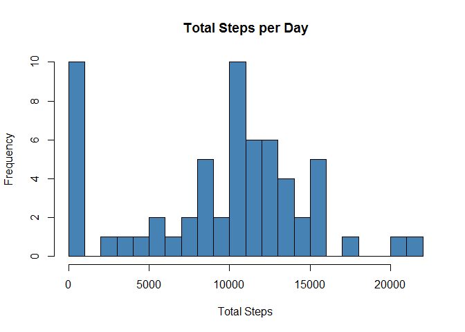
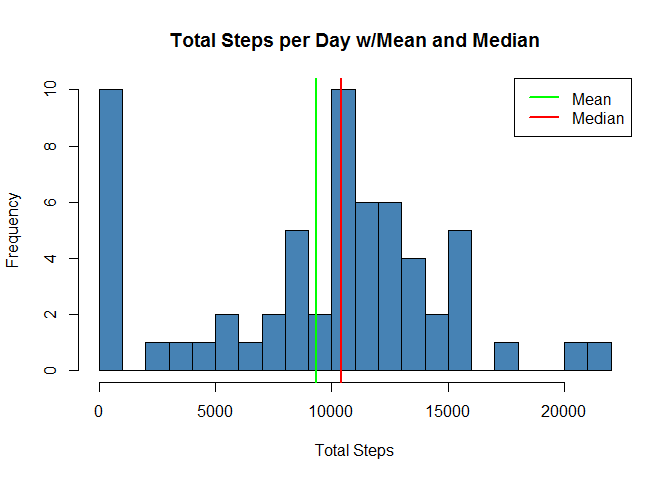
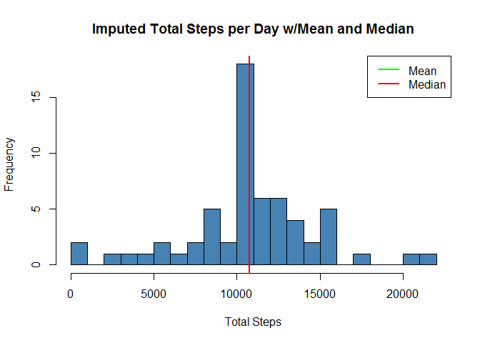
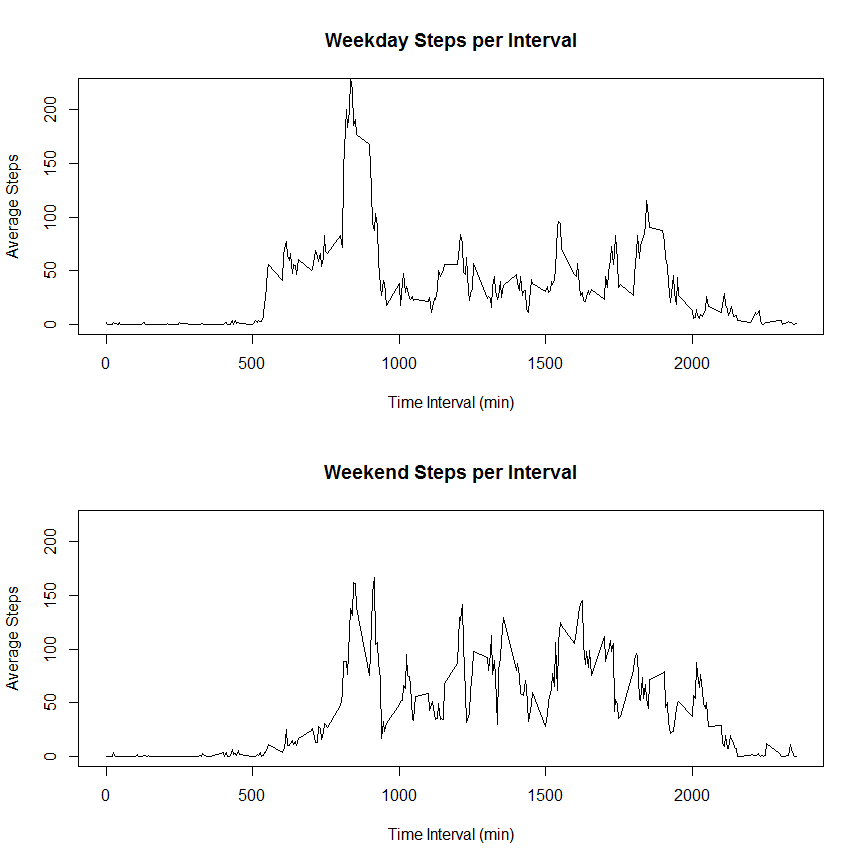

# Reproducible Research: Peer Assessment 1

## Overview

In this short analysis, we will be concerned with the *"activity.csv"* dataset, a log of an individual's activity broken into 5 minute intervals. Using these data, we will explore the individual's daily step totals, their average daily activity, and the effects of imputing missing values in the dataset. 

## Loading and preprocessing the data

Let's load and analyze the dataset provided for this assignment, which is stored locally as *"activity.csv"*. We'll use the *read.csv()* function to read in the data and store it in the cache so it doesn't need to be repeatedly reloaded. And while we're at it, let's make a summary of the data to see what's there.


```r
activity_data <- read.csv("./activity.csv")
summary(activity_data)
```

```
##      steps                date          interval     
##  Min.   :  0.00   2012-10-01:  288   Min.   :   0.0  
##  1st Qu.:  0.00   2012-10-02:  288   1st Qu.: 588.8  
##  Median :  0.00   2012-10-03:  288   Median :1177.5  
##  Mean   : 37.38   2012-10-04:  288   Mean   :1177.5  
##  3rd Qu.: 12.00   2012-10-05:  288   3rd Qu.:1766.2  
##  Max.   :806.00   2012-10-06:  288   Max.   :2355.0  
##  NA's   :2304     (Other)   :15840
```

Alright, so based on our summary we see that there are a fair number of "NA" values in our *steps* variable; this might come up a fair amount going forward. The data appear to be in a pretty usable format, so having noted that, let's move on to some more analyses. 

## What is mean total number of steps taken per day?

A natural starting point in this dataset is to ask how many steps were taken each day. Let's create a histogram to show this. The first thing we need to do is sum each day's steps so that we have one value per day. We can use *tapply()* to accomplish this, and then we'll plot the resulting totals using *hist()*.


```r
totals <- tapply(activity_data$steps,activity_data$date,sum,na.rm=TRUE)
hist(totals,breaks = 20,col="steelblue",xlab = "Total Steps",
     main = "Total Steps per Day")
```

<!-- -->

At first glance, this looks a little odd in that there are 10 days with only 0-1000 steps; however, upon looking at the raw dataset, this seems to be correct. For instance, the first day ("2012-10-01") does not have any steps recorded and the second day ("2012-10-02") has only a couple hundred. A lot of this appears to be caused by missing values, but we can address that later. For now, it suffices to say that even though this histogram looks strange at first, it certainly seems to correspond to the data. 

We've looked at the distribution of steps, but how about the center of the distribution? We can calculate the mean and median straightforwardly by using the appropriate functions, *mean()* and *median()*.  


```r
mean(totals)
```

```
## [1] 9354.23
```

```r
median(totals)
```

```
## [1] 10395
```

We see based on these outputs that both values are around 10,000. To better understand them, let's plot them on our histogram


```r
hist(totals,breaks = 20,col="steelblue",xlab = "Total Steps",
     main = "Total Steps per Day w/Mean and Median")
abline(v = mean(totals),col = 'green',lwd = 2)
abline(v = median(totals),col = 'red',lwd = 2)
legend("topright",col = c('green','red'), legend = c('Mean','Median'),
       lty = 1, lwd = 2)
```

<!-- -->

As we expected, these two lines both appear in the vicinity of 10,000 steps. Now that we've characterized the steps for each day, let's take a look at this individual's average day and see what we can say about them.

## What is the average daily activity pattern?

Now instead of looking at day to day steps, let's see what happens if we consider our "average" day. The average day is defined by 5 minute time intervals, ranging from 0 to 2355 as shown by our previous summary. So let's use tapply to find the mean of the steps in each interval.


```r
daily <- tapply(activity_data$steps,activity_data$interval,mean,na.rm=TRUE)
```

We can now use these mean values along with their labels to plot a time series plot of steps against time interval.

```r
plot(x = names(daily),y = daily,type = "l", 
     xlab = 'Time Interval (min)',ylab = 'Average Steps',
     main = 'Average Daily Steps per Time Interval')
```

<!-- -->

The plot shows trends that make a lot of sense; in the first 500 minutes, there are almost no steps, likely because the individual is in bed. This is followed by a series of peaks, with the largest peak coming somewhere around the 800 minute mark. In fact, we can find exactly what the peak interval is by using the *which.max* function.

```r
which.max(daily)
```

```
## 835 
## 104
```

Because the *daily* variable is a named list, we get two numbers here: 104 is the index, so we know that the maximum step number is the 104th entry; 835 is the interval where that maximum occurs. So we have found our answer: the maximum average step number occurs in the 835th minute interval. Just as a sanity check, let's check what that number actually is. 


```r
daily["835"]
```

```
##      835 
## 206.1698
```

It's just over 200 steps, which matches what we saw in our time-series plot. We don't know exactly what the individual is doing at that time, but they appear to engage in some sort of daily activity that involves a lot of steps. This might be a portion of the data we'd like to investigate more fully in the future. 

## Imputing missing values

A frustrating thing about this dataset is that there are a lot of missing values as we saw earlier, 2304 of the 17568 step measurements (13%). To be sure there are no other rows with missing values in other columns, let's quickly verify the number of missing values.


```r
missing <- activity_data[!complete.cases(activity_data),]
dim(missing)
```

```
## [1] 2304    3
```

Just as we suspected from our earlier summary, we have 2304 rows with missing values, so we can infer that the missing values are all in the *steps* variable. This could be biasing our analysis, so it would be great if we could somehow fill in these values. One way to do this is by "imputing" these missing values by using existing values in the dataset. 

There are a number of ways to do this; we could, for each time interval, take the mean or median value and fill in the missing value with the computed average. We could also try interpolating from the surrounding values; in other words, if our data point is missing, we can use the two bordering data points to estimate the steps in between. This latter strategy is somewhat more attractive, as it better accounts for what was happening immediately before and after a missing value. However, it is not as robust as the the previous two strategies. Suppose, as in the case of our first day, that we have an entire day full of "NA" values. We would have no surrounding data points and, therefore, no way to impute our values. 

Based upon this shortcoming, we are left with using either the mean or the median of the same time intervals on other days. We have already seen what the mean of each time interval looks like; what about the median?

```r
meds <- tapply(activity_data$steps,activity_data$interval,median,na.rm=TRUE)
summary(meds)
```

```
##    Min. 1st Qu.  Median    Mean 3rd Qu.    Max. 
##   0.000   0.000   0.000   3.962   0.000  60.000
```

We see immediately that the median of each 5-minute interval is probably going to fill in a lot of 0's because of a large number of entries with 0 steps. Maybe this isn't a problem, but I'd rather use the mean, which we've seen is more diverse and I think represents the average value a bit better for each interval. So we're back to working with the *daily* variable we already created. 

To impute, we're going to need to do a few things:

1. Find each missing values
2. Find the time interval of that missing value
3. Fill in the appropriate mean using the *daily* intervals

We'll do that now, creating a new *imputed_data* variable in the dataset that we can later compare to the original steps if need be. 


```r
activity_data$imputed_data <- activity_data$steps

impute_steps <- function(df,daily){
    # Find and fill in the missing values 
    for (i in which(is.na(df$imputed_data))){
        df$imputed_data[i] <- daily[as.character(df$interval[i])]  
    }
    df
}

activity_data <- impute_steps(activity_data,daily)
summary(activity_data)
```

```
##      steps                date          interval       imputed_data   
##  Min.   :  0.00   2012-10-01:  288   Min.   :   0.0   Min.   :  0.00  
##  1st Qu.:  0.00   2012-10-02:  288   1st Qu.: 588.8   1st Qu.:  0.00  
##  Median :  0.00   2012-10-03:  288   Median :1177.5   Median :  0.00  
##  Mean   : 37.38   2012-10-04:  288   Mean   :1177.5   Mean   : 37.38  
##  3rd Qu.: 12.00   2012-10-05:  288   3rd Qu.:1766.2   3rd Qu.: 27.00  
##  Max.   :806.00   2012-10-06:  288   Max.   :2355.0   Max.   :806.00  
##  NA's   :2304     (Other)   :15840
```

As we see from our summary, the new variable contains no NA's and the 3rd quantile has shifted a bit, but otherwise the data look basically the same. Of course, it's hard to really tell from just looking at the summary, so let's remake our histogram from before and see if it looks the same. We'll go ahead and plot the mean and median as we did before. 


```r
totals <- tapply(activity_data$imputed_data,activity_data$date,sum,na.rm=TRUE)
hist(totals,breaks = 20,col="steelblue",xlab = "Total Steps",
     main = "Imputed Total Steps per Day w/Mean and Median")
abline(v = mean(totals),col = 'green',lwd = 2)
abline(v = median(totals),col = 'red',lwd = 2)
legend("topright",col = c('green','red'), legend = c('Mean','Median'),
       lty = 1, lwd = 2)
```

<!-- -->

This distribution looks much different; now that we've imputed the missing values, the distribution is much less dominated by days with 0 steps and instead, looks to be centered around 10,000-11,000 steps. 

We see that our mean and median for our daily totals appear to have both changed; the median appears to have increased just a bit and the mean has increased by what looks like quite a lot. In fact, because the lines are right on top of each other, it looks like they're the same exact value. What are the actual new values?


```r
mean(totals)
```

```
## [1] 10766.19
```

```r
median(totals)
```

```
## [1] 10766.19
```

As we saw from the plot, both of our previous estimates have now increased, the mean doing so substantially. By imputing the missing data as we did, we shifted our estimate of where the data are centered by moving it higher, inflating our two calculated values. It is important that we keep in mind what we have done because there is a risk that our imputing has caused us to overestimate the mean and median. 


## Are there differences in activity patterns between weekdays and weekends?

We have looked at each day as if they are all equivalent, but our personal experiences may lead us to believe that the day of the week could influence activity levels. For instance, perhaps we could hypothesize that this individual would be more active on weekends due to more time flexibility. In order to examine this idea, let's add a factor variable to our dataset. We'll define a function to do this and run it.

```r
add_weekday <- function(df){
    
    # Define the days themselves
    days <- weekdays(as.Date(df$date))
    df$weekday <- NA
    
    # Assign the factor for each day
    for(i in 1:length(days)){
        if(days[i] %in% c("Saturday","Sunday")){
            df$weekday[i] <- "Weekend"
        }
        else{df$weekday[i] <- "Weekday"}
    }
    df$weekday <- as.factor(df$weekday)
    df
}

activity_data <- add_weekday(activity_data)
summary(activity_data$weekday)
```

```
## Weekday Weekend 
##   12960    4608
```

As we can see from our summary, there are around 3 times as many weekdays as weekends, which is about what we would expect with a dataset that starts on a Monday and ends on a Friday. Now that we have our data, let's take a look at what differences we can find between these two factors

Just as we did before, let's compute the daily averages for each time interval, but this time let's go a step further and separate them based on weekday/weekend first.


```r
in_week <- subset(activity_data, weekday == "Weekday")
out_week <- subset(activity_data,weekday == "Weekend")
daily_weekday <- tapply(in_week$imputed_data,in_week$interval,mean)
daily_weekend <- tapply(out_week$imputed_data,out_week$interval,mean)
```

Now that we have our daily 5-minute interval averages, let's plot the weekend and weekday on top of one another to see what it looks like.


```r
par(mfrow = c(2,1))
plot(x = names(daily_weekday),y = daily_weekday,type = "l", ylim = c(0,220),
     xlab = 'Time Interval (min)',ylab = 'Average Steps',
     main = 'Weekday Steps per Interval')
plot(x = names(daily_weekend),y = daily_weekend,type = "l", ylim = c(0,220),
     xlab = 'Time Interval (min)',ylab = 'Average Steps',
     main = 'Weekend Steps per Interval')
```

<!-- -->

Looking at these two plots, it's pretty clear that the individual has higher maximum number of steps during the weekday. However, it also looks like weekends have more medium-sized peaks in between the maximum and minimum activity levels. 
## Conclusions

We have examined the "activity_data.csv" dataset in a number of ways. Namely, we have:

1. Read in and briefly summarized the data
2. Examined the total steps per day using a histogram and by evaluating the mean and median.
3. Explored the average daily steps per time interval using a time series plot and found the interval with the maximum average daily steps, interval 835. 
4. Imputed for the missing values and used these to recreate our histogram and recalculate our mean and median values.
5. Separated our imputed values based on a new "weekday" variable, then used this split to compare average daily steps per time interval between weekday and weekend days. 
